# Full Mode Scraping: Flow Diagram & Return Format Specification

## Context

Documentation of the complete Full Mode scraping pipeline in config-db, including the data flow, processing stages, and the exact format of allowed return values from scrapers.

---

## Flow Diagram (Mermaid)

```mermaid
flowchart TD
    A["RunScraper(ctx)"] --> B["InitTempCache"]
    B --> C["Run(ctx)"]
    C --> D{"For each Scraper in All"}
    D -->|CanScrape?| E["scraper.Scrape(ctx) -> ScrapeResults"]
    E --> F["processScrapeResult(ctx, result)"]

    F --> G["1. ApplyAnalysisRules(&result)"]
    G --> H["2. SummarizeChanges(result.Changes)"]
    H --> I{"result.Config == nil?"}
    I -->|yes| J["Return [result] as-is"]
    I -->|no| K["3. NewExtractor(BaseScraper)"]

    K --> L["4. extractor.Extract(ctx, result)"]
    L --> L1["4a. Format conversion (YAML/JSON/Properties)"]
    L1 --> L2["4b. Items JSONPath extraction (if .Items set)"]
    L2 --> L3["4c. Script transformation"]
    L3 --> L4["4d. extractAttributes() via JSONPath"]
    L4 --> L5["4e. applyMask() for sensitive data"]
    L5 --> L6["4f. Property templating"]

    L6 --> M{"ctx.ScrapeConfig().Spec.Full?"}
    M -->|no| N["Return scraped results"]
    M -->|yes| O["5. ExtractFullMode(resolver, scraperID, originalConfig, scraped)"]

    O --> P["ExtractConfigChangesFromConfig(resolver, scraperID, config)"]
    P --> P1["Parse config map for reserved keys"]
    P1 --> P2["sanitizeConfigIDFields (non-UUID config_id -> external_id)"]
    P2 --> P3["Unmarshal: changes, analysis, access_logs, config_access, users, groups, roles, user_groups"]
    P3 --> P4["expandConfigAccessShorthand (user/role/group aliases)"]
    P4 --> P5["expandAccessLogShorthand"]
    P5 --> P6["applyConfigRefDefaults (inherit top-level config_id/type)"]
    P6 --> P7{"resolver != nil?"}
    P7 -->|yes| P8["SyncEntities -> ResolveAccess"]
    P7 -->|no| P9["Return parsed result"]
    P8 --> P9

    P9 --> Q["Merge extracted entities into scraped results"]
    Q --> R["Append entity-only ScrapeResults for each entity type"]
    R --> N

    N --> S["Collect all results"]
    S --> T{"Rate Limited?"}
    T -->|yes| U["Return early, skip save"]
    T -->|no| V["db.SaveResults(ctx, results)"]

    V --> V1["extractConfigsAndChangesFromResults"]
    V1 --> V2["Batch insert new configs"]
    V2 --> V3["syncExternalEntities"]
    V3 --> V4["Resolve & upsert config access"]
    V4 --> V5["Save access logs"]
    V5 --> V6["updateCI for each changed config (diff detection)"]
    V6 --> V7["dedupChanges & bulk insert changes"]
    V7 --> W["UpdateStaleConfigItems"]
    W --> X["Return ScrapeOutput with ScrapeSummary"]
```



---

## Return Format Specification

### 1. ScrapeResult (core return type from any scraper)

**File**: `api/v1/interface.go:859-932`

| Field | Type | Required | Description |
|-------|------|----------|-------------|
| `ID` | `string` | **Yes** | External ID at origin (Azure resource ID, K8s UID, ARN). If valid UUID and `ConfigID` is nil, used as DB primary key. |
| `Type` | `string` | **Yes** | Config type classification (e.g. `AWS::EC2::Instance`, `Kubernetes::Pod`). Free-form string, convention is `Provider::Service::Resource`. |
| `Config` | `any` | **Yes** | The actual config data. See [Config Field Format](#config-field-format) for allowed types. |
| `BaseScraper` | `BaseScraper` | **Yes** | Scraper configuration (auto-populated via `NewScrapeResult`). |
| `Name` | `string` | Recommended | Human-readable name. Defaults to `ID` if empty. |
| `ConfigClass` | `string` | Optional | Category (e.g. `Compute`, `Storage`, `Cluster`). Free-form string. |
| `ConfigID` | `*string` | Optional | Persistent UUID string. Generated if absent. Not serialized to JSON (`json:"-"`). |
| `Status` | `string` | Optional | Free-form status string extracted from config itself. |
| `Health` | `models.Health` | Optional | **Allowed values:** `"healthy"`, `"unhealthy"`, `"warning"`, `"unknown"` |
| `Ready` | `bool` | Optional | Readiness indicator. |
| `Description` | `string` | Optional | Detailed description. |
| `Aliases` | `[]string` | Optional | Alternative identifiers for lookup. |
| `Source` | `string` | Optional | Origin descriptor. |
| `Format` | `string` | Optional | See [Format Field](#format-field-processing). |
| `Icon` | `string` | Optional | Icon identifier. |
| `Labels` | `JSONStringMap` | Optional | Key-value string map. |
| `Tags` | `JSONStringMap` | Optional | Key-value string map. **Max 5 tags** (validated, excess rejected). |
| `Properties` | `types.Properties` | Optional | Custom templatable properties. |
| `Locations` | `[]string` | Optional | Geographic locations. |
| `CreatedAt` | `*time.Time` | Optional | Creation timestamp. |
| `DeletedAt` | `*time.Time` | Optional | Deletion timestamp. |
| `DeleteReason` | `ConfigDeleteReason` | Optional | **Allowed values:** `"STALE"`, `"FROM_ATTRIBUTE"`, `"FROM_DELETE_FIELD"`, `"FROM_EVENT"`, `"SCRAPER_DELETED"` |
| `LastModified` | `time.Time` | Optional | Last modification time. |
| `Error` | `error` | Optional | Error during scraping. Not serialized (`json:"-"`). |
| `ScraperLess` | `bool` | Optional | Config not bound to any scraper (e.g. AWS regions). |
| `OmitNilFields` | `*bool` | Optional | Whether to omit nil fields in config (default: true). Not serialized (`json:"-"`). |

**Relationship fields:**

| Field | Type | Description |
|-------|------|-------------|
| `Parents` | `[]ConfigExternalKey` | Candidate parent configs (ordered by precision). |
| `Children` | `[]ConfigExternalKey` | Child configs whose parent should be set to this item. |
| `RelationshipResults` | `RelationshipResults` | Direct relationship links. |
| `RelationshipSelectors` | `[]DirectedRelationship` | Selector-based relationships (without knowing external IDs). |

**Full Mode fields (populated by extraction, not by scraper directly):**

| Field | Type | Description |
|-------|------|-------------|
| `Changes` | `[]ChangeResult` | Config changes detected. |
| `AnalysisResult` | `*AnalysisResult` | Analysis findings. |
| `ExternalUsers` | `[]models.ExternalUser` | User entities. |
| `ExternalGroups` | `[]models.ExternalGroup` | Group entities. |
| `ExternalRoles` | `[]models.ExternalRole` | Role entities. |
| `ExternalUserGroups` | `[]models.ExternalUserGroup` | User-group mappings. |
| `ConfigAccess` | `[]ExternalConfigAccess` | Access control entries. |
| `ConfigAccessLogs` | `[]ExternalConfigAccessLog` | Access audit logs. |

---

### Config Field Format

The `Config` field on `ScrapeResult` accepts several types, processed differently based on `Format`:

| `Config` Go Type | `Format` Value | Processing |
|------------------|----------------|------------|
| `string` | `"properties"` | Parsed via `properties.LoadString()` into `map[string]any`. Comments (`#`) and tabs stripped. |
| `string` | `"yaml"`, `"json"`, or `""` (empty) | Converted to JSON via `yaml.YAMLToJSON()`. Empty format is treated as YAML/JSON. |
| `string` | any other value | Wrapped as `map[string]any{"format": <format>, "content": <original string>}` |
| non-string (map, struct, etc.) | _ignored_ | Serialized to JSON using `oj.JSON()` with `OmitNil`, `Sort: true`, `UseTags: true`, `FloatFormat: "%g"` |

**In Full Mode** (`Spec.Full: true`), the `Config` field **must** be a `map[string]any` after format processing. If it is not a map, `ExtractConfigChangesFromConfig` returns an error.

**File**: `scrapers/processors/json.go:372-413`

---

### Format Field Processing

**Allowed values for `Format`:**

| Value | Meaning |
|-------|---------|
| `"json"` | Config is a JSON string |
| `"yaml"` | Config is a YAML string |
| `"properties"` | Config is a Java-style properties string |
| `""` (empty/default) | Treated identically to `"yaml"` / `"json"` (auto-detected) |
| _any other string_ | Custom format; config string is wrapped in `{"format": "...", "content": "..."}` |

---

## 2. Full Mode Config Map Format

When `Spec.Full: true`, the `Config` field (must be `map[string]any`) is parsed for **reserved top-level keys**. The first matching key alternative is used; remaining alternatives are ignored.

**File**: `scrapers/extract/extract.go:170-224`

### Reserved Keys

| Data | Key Alternatives (first match wins) |
|------|--------------------------------------|
| Actual config to persist | `"config"` |
| Changes | `"changes"` |
| Analysis | `"analysis"` |
| Access logs | `"access_logs"`, `"logs"` |
| Config access | `"config_access"`, `"access"` |
| External users | `"external_users"`, `"users"` |
| External groups | `"external_groups"`, `"groups"` |
| External roles | `"external_roles"`, `"roles"` |
| External user groups | `"external_user_groups"`, `"user_groups"` |

### Top-Level Config Reference Defaults

These top-level keys provide default values inherited by changes, analysis, config_access, and access_logs items that lack explicit config references:

| Key | Alternatives | Type | Description |
|-----|-------------|------|-------------|
| `uuid` | `config_id` | `string` | **Must be a valid UUID**. Non-UUID values are silently ignored. |
| `external_id` | _(none)_ | `string` | External identifier for the config. |
| `type` | `config_type` | `string` | Config type string. |

**Mutual exclusivity:** `uuid`/`config_id` (resolved UUID) takes precedence over `external_id`. If a valid UUID is found, it is used as `ConfigID`; otherwise `external_id` + `type` are used as `ConfigExternalID`.

### Inheritance Rules

Defaults are only applied when the item's own fields are empty/nil:

| Entity Type | Condition for Inheriting | Fields Inherited |
|-------------|-------------------------|------------------|
| `config_access` | `ConfigID == uuid.Nil` AND `ConfigExternalID.IsEmpty()` | `ConfigID` or `ConfigExternalID` |
| `access_logs` | `ConfigID == uuid.Nil` | `ConfigID` or `ConfigExternalID` |
| `changes` | `ExternalID == ""` or `ConfigType == ""` | `ExternalID`, `ConfigType` (independently) |
| `analysis` | `ExternalID == ""` AND `len(ExternalConfigs) == 0` | `ExternalID`, `ConfigType` |

**`ExternalID.IsEmpty()` definition**: Returns true when `ConfigID == uuid.Nil` AND (`ConfigType == ""` OR `ExternalID == ""`). Both `ConfigType` and `ExternalID` must be set for a non-empty external reference.

### Processing Pipeline Order

1. **sanitizeConfigIDFields** — For `access_logs`/`logs`/`config_access`/`access` items: if `config_id` is present but NOT a valid UUID, move it to `external_id` (only if `external_id` is not already set), then delete `config_id`.
2. **JSON Unmarshal** — Deserialize each reserved key into its Go struct.
3. **expandConfigAccessShorthand** — Expand `user`/`role`/`group` shorthand and resolve config refs from raw map.
4. **expandAccessLogShorthand** — Resolve config refs from raw access log maps.
5. **applyConfigRefDefaults** — Inherit top-level defaults into items missing config references.
6. **validateConfigRefs** — Drop items that still lack required config references (with warnings).
7. **SyncEntities** — Sync external users/groups/roles to DB (if resolver is non-nil).
8. **ResolveAccess** — Resolve aliases to UUIDs and lookup external IDs to config IDs (if resolver is non-nil).

---

## 3. ChangeResult

**File**: `api/v1/interface.go:85-121`

| Field | Type | Required | JSON Tag | Description |
|-------|------|----------|----------|-------------|
| `ExternalID` | `string` | **Required**\* | `external_id` | External ID of target config. Validated: items missing this after defaults are **dropped**. |
| `ConfigType` | `string` | **Required**\* | `config_type` | Type of target config. Can inherit from top-level `type`/`config_type` default. |
| `ScraperID` | `string` | Optional | `scraper_id` | Scraper ID for config lookup. `""` = current scraper, `"all"` = cross-scraper lookup. |
| `ExternalChangeID` | `string` | **Required** | `external_change_id` | Unique change identifier (used for deduplication). Items without this are **dropped**. |
| `Action` | `ChangeAction` | Optional | `action` | See [ChangeAction values](#changeaction-allowed-values). |
| `ChangeType` | `string` | **Required** | `change_type` | Category of change. Known constants: `"diff"`, `"PermissionAdded"`, `"PermissionRemoved"`. Free-form. Items without this are **dropped**. |
| `Patches` | `string` | Optional | `patches` | JSON patch string describing the change. |
| `Diff` | `*string` | Optional | `diff,omitempty` | Textual diff. |
| `Summary` | `string` | Optional | `summary` | Human-readable summary. Auto-generated from patches if empty. |
| `Severity` | `string` | Optional | `severity` | Free-form severity string (e.g. `"critical"`, `"high"`, `"medium"`, `"low"`, `"info"`). |
| `Source` | `string` | Optional | `source` | Origin of change. |
| `CreatedBy` | `*string` | Optional | `created_by` | Email/identifier of change author. |
| `CreatedAt` | `*time.Time` | Optional | `created_at` | When change occurred. |
| `Details` | `map[string]any` | Optional | `details` | Arbitrary structured metadata. |
| `ConfigID` | `string` | Optional | `configID,omitempty` | Direct config UUID (bypasses external lookup). |
| `UpdateExisting` | `bool` | Optional | `update_existing` | Update existing change record instead of creating new. |

\* Inherited from top-level config map defaults if empty. After inheritance, `ExternalID` is **required** — items without it are dropped with a warning.

**Mutual exclusivity:**
- `ConfigID` (direct UUID) vs `ExternalID` + `ConfigType` (external lookup): If `ConfigID` is set, it is used directly. Otherwise `ExternalID` + `ConfigType` are used for lookup.
- `Action` values `"move-up"` / `"copy-up"` use `AncestorType` (internal, not from JSON).
- `Action` values `"copy"` / `"move"` use `Target` selector (internal, not from JSON).

### ChangeAction Values

**File**: `api/v1/const.go:3-12`

Free-form string. Common values with special handling:

| Value | Description |
|-------|-------------|
| `"delete"` | Delete the target config item |
| `"ignore"` | Ignore the change (do not persist) |
| `"move-up"` | Move change to parent ancestor (requires `AncestorType`, set by change mapping rules) |
| `"copy-up"` | Copy change to parent ancestor (requires `AncestorType`, set by change mapping rules) |
| `"copy"` | Copy change to target config (requires `Target` selector, set by change mapping rules) |
| `"move"` | Move change to target config (requires `Target` selector, set by change mapping rules) |

Any other string value (e.g. `"Updated"`, `"ScaleUp"`) is stored as-is without special handling.

---

## 4. AnalysisResult

**File**: `api/v1/interface.go:50-65`

| Field | Type | Required | JSON Tag | Description |
|-------|------|----------|----------|-------------|
| `ExternalID` | `string` | **Conditional**\* | `external_id,omitempty` | External ID of the config this analysis applies to. |
| `ConfigType` | `string` | Optional | `config_type,omitempty` | Type of the config. |
| `Summary` | `string` | Optional | `summary,omitempty` | Brief description. |
| `Analysis` | `map[string]any` | Optional | `analysis,omitempty` | Structured findings. |
| `AnalysisType` | `models.AnalysisType` | Optional | `analysis_type,omitempty` | See [AnalysisType values](#analysistype-allowed-values). |
| `Severity` | `models.Severity` | Optional | `severity,omitempty` | See [Severity values](#severity-allowed-values). |
| `Source` | `string` | Optional | `source,omitempty` | Origin. |
| `Analyzer` | `string` | Optional | `analyzer,omitempty` | Identifier (matched against built-in rules for type/severity). |
| `Messages` | `[]string` | Optional | `messages,omitempty` | Detail messages (joined with `<br><br>` for DB storage). |
| `Status` | `string` | Optional | `status,omitempty` | Current status. Free-form. |
| `FirstObserved` | `*time.Time` | Optional | `first_observed,omitempty` | First seen. |
| `LastObserved` | `*time.Time` | Optional | `last_observed,omitempty` | Last seen. |
| `ExternalConfigs` | `[]ExternalID` | Optional | `external_configs,omitempty` | Related config references (alternative to single ExternalID). |

\* **Validation rule:** Must have EITHER `ExternalID != ""` OR `len(ExternalConfigs) > 0`. Items with neither are **dropped** with a warning. These are mutually exclusive ways to reference the target config(s).

### AnalysisType Allowed Values

| Value |
|-------|
| `"availability"` |
| `"compliance"` |
| `"cost"` |
| `"integration"` |
| `"other"` |
| `"performance"` |
| `"recommendation"` |
| `"reliability"` |
| `"security"` |
| `"technical_debt"` |

### Severity Allowed Values

| Value |
|-------|
| `"info"` |
| `"low"` |
| `"medium"` |
| `"high"` |
| `"critical"` |

---

## 5. ExternalConfigAccess

**File**: `api/v1/interface.go:1285-1308`

| Field | Type | Required | JSON Tag | Description |
|-------|------|----------|----------|-------------|
| `ID` | `string` | Optional | `id` | Unique identifier for the access entry. |
| `ConfigID` | `uuid.UUID` | **Conditional**\* | `config_id` | Direct config UUID. |
| `ConfigExternalID` | `ExternalID` | **Conditional**\* | `external_config_id` | External config reference (resolved to `ConfigID` during ResolveAccess). |
| `ExternalUserID` | `*uuid.UUID` | Optional | `external_user_id` | Resolved user UUID. |
| `ExternalGroupID` | `*uuid.UUID` | Optional | `external_group_id` | Resolved group UUID. |
| `ExternalRoleID` | `*uuid.UUID` | Optional | `external_role_id` | Resolved role UUID. |
| `ExternalUserAliases` | `[]string` | Optional | `external_user_aliases` | User aliases; expanded from `user` shorthand. |
| `ExternalRoleAliases` | `[]string` | Optional | `external_role_aliases` | Role aliases; expanded from `role` shorthand. |
| `ExternalGroupAliases` | `[]string` | Optional | `external_group_aliases` | Group aliases; expanded from `group` shorthand. |
| `ScraperID` | `*uuid.UUID` | **Conditional**\*\* | `scraper_id` | Defaults to requester's scraper ID if nil. |
| `ApplicationID` | `*uuid.UUID` | **Conditional**\*\* | `application_id` | Application context. |
| `Source` | `*string` | **Conditional**\*\* | `source` | Source identifier. |
| `CreatedAt` | `time.Time` | Optional | `created_at` | Creation timestamp. |
| `DeletedAt` | `*time.Time` | Optional | `deleted_at` | Deletion timestamp. |
| `DeletedBy` | `*uuid.UUID` | Optional | `deleted_by` | Who deleted the entry. |
| `CreatedBy` | `*uuid.UUID` | Optional | `created_by` | Who created the entry. |
| `LastReviewedAt` | `*time.Time` | Optional | `last_reviewed_at` | Last review timestamp. |
| `LastReviewedBy` | `*uuid.UUID` | Optional | `last_reviewed_by` | Who last reviewed. |

\* **Validation rule:** Must have EITHER `ConfigID != uuid.Nil` OR `ConfigExternalID.ExternalID != ""`. Items with neither are **dropped**. Additionally, must have at least one principal (user, group, or role via ID or aliases); items without are **dropped** with warning "config_access missing user/group reference".

\*\* **Resolution rule:** At least one of `ScraperID`, `ApplicationID`, or `Source` must be non-nil after resolution. `ScraperID` defaults to the requester's scraper ID.

**Shorthand expansion** (`expandConfigAccessShorthand`):

| YAML Key | Expanded To | Type |
|----------|-------------|------|
| `user` | `ExternalUserAliases` | `string` or `[]string` |
| `role` | `ExternalRoleAliases` | `string` or `[]string` |
| `group` | `ExternalGroupAliases` | `string` or `[]string` |
| `config_id`/`uuid` | `ConfigID` (if valid UUID) or `ConfigExternalID` | `string` |
| `external_id` | `ConfigExternalID.ExternalID` | `string` |
| `config_type`/`type` | `ConfigExternalID.ConfigType` | `string` |

Shorthand is only applied when the corresponding struct field is empty/nil.

**Alias resolution** (`resolveConfigAccessAliases`):
- For each alias type (user/role/group): if the ID field is nil but aliases are set, lookup existing entity by aliases.
- If not found: a new entity is **auto-created** with `ID = uuid.New()`, `Name = first alias`, `Aliases = full alias list`.

---

## 6. ExternalConfigAccessLog

**File**: `api/v1/interface.go:1252-1256`

Embeds `models.ConfigAccessLog` plus external resolution fields.

| Field | Type | Required | JSON Tag | Description |
|-------|------|----------|----------|-------------|
| `ConfigID` | `uuid.UUID` | **Conditional**\* | _(embedded)_ | Direct config UUID. |
| `ConfigExternalID` | `ExternalID` | **Conditional**\* | `external_config_id,omitempty` | External config reference. |
| `ExternalUserAliases` | `[]string` | Optional | `external_user_aliases,omitempty` | User aliases; expanded from `user` shorthand. |

\* **Validation rule:** Must have EITHER `ConfigID != uuid.Nil` OR `ConfigExternalID.ExternalID != ""`. Items with neither are **dropped**. Additionally, must have either `ExternalUserID` or `ExternalUserAliases`; items without are **dropped** with warning "access_log missing user reference".

**Shorthand expansion** (`expandAccessLogShorthand`):

| YAML Key | Expanded To | Type |
|----------|-------------|------|
| `user` | `ExternalUserAliases` | `string` or `[]string` |
| `config_id`/`uuid` | `ConfigID` (if valid UUID) or `ConfigExternalID` | `string` |
| `external_id` | `ConfigExternalID.ExternalID` | `string` |
| `config_type`/`type` | `ConfigExternalID.ConfigType` | `string` |

---

## 7. ExternalID (config reference type)

**File**: `api/v1/types.go:190-201`

| Field | Type | JSON Tag | Description |
|-------|------|----------|-------------|
| `ConfigID` | `uuid.UUID` | `config_id,omitempty` | Direct config UUID. `uuid.Nil` when unset. |
| `ConfigType` | `string` | `config_type,omitempty` | Config type for external lookup. |
| `ExternalID` | `string` | `external_id,omitempty` | External identifier string. |
| `ScraperID` | `string` | `scraper_id,omitempty` | `""` = current scraper, `"all"` = cross-scraper. |
| `Labels` | `map[string]string` | `labels,omitempty` | Label filters for lookup. |

**`IsEmpty()` logic** (`api/v1/types.go:243-245`):
```
ConfigID == uuid.Nil AND (ConfigType == "" OR ExternalID == "")
```
Both `ConfigType` AND `ExternalID` must be non-empty for a valid external reference.

**Mutual exclusivity:** `ConfigID` (UUID) vs `ExternalID` + `ConfigType` (external lookup). The pipeline checks `ConfigID` first; if set, `ExternalID`/`ConfigType` are ignored for lookup.

---

## 8. ConfigExternalKey (parent/child references)

**File**: `api/v1/interface.go:843-847`

```go
type ConfigExternalKey struct {
    ExternalID string  // External ID of the config
    Type       string  // Config type
    ScraperID  string  // Optional: "" = current scraper, "all" = any
}
```

---

## 9. UUID Detection Logic

Used in `sanitizeConfigIDFields`, `parseConfigRef`, and `applyConfigRefDefaults`:

```
uuid.Parse(value) → if err == nil: treat as ConfigID (UUID)
                   → if err != nil: treat as ExternalID (string)
```

This means:
- `config_id: "550e8400-e29b-41d4-a716-446655440000"` → stored as `ConfigID` (UUID)
- `config_id: "arn:aws:ec2:us-east-1:123456:instance/i-abc"` → moved to `external_id`
- `config_id: "my-resource"` → moved to `external_id`

The move only happens if `external_id` is not already set on the item. If both `config_id` (non-UUID) and `external_id` are present, `config_id` is deleted and `external_id` is preserved.

---

## 10. Full Mode Config Map Example

```yaml
# Top-level config reference defaults (inherited by items below)
uuid: "550e8400-e29b-41d4-a716-446655440000"   # OR config_id (must be valid UUID)
external_id: "arn:aws:ec2:us-east-1:123:i-abc"
type: "AWS::EC2::Instance"                       # OR config_type

# The actual config data to persist (everything else is stripped)
config:
  instanceId: i-abc
  state: running

# Changes
changes:
  - external_id: "arn:aws:ec2:us-east-1:123:i-abc"   # REQUIRED (or inherited)
    config_type: "AWS::EC2::Instance"                   # REQUIRED (or inherited)
    external_change_id: "change-456"
    change_type: "diff"
    action: "delete"                                    # delete|ignore|move-up|copy-up|copy|move
    patches: '{"op":"replace","path":"/state","value":"stopped"}'
    summary: "Instance stopped"
    severity: "medium"
    source: "CloudTrail"
    created_by: "user@example.com"
    created_at: "2024-01-01T00:00:00Z"
    details:
      event_name: StopInstances

# Analysis
analysis:
  - analyzer: "cost"
    summary: "High cost detected"
    analysis_type: "cost"                   # availability|compliance|cost|integration|other|performance|recommendation|reliability
    severity: "high"                        # info|low|medium|high|critical
    messages: ["Cost exceeded threshold"]
    status: "open"
    # MUST have external_id OR external_configs (not both needed, but one required)
    external_id: "arn:aws:ec2:us-east-1:123:i-abc"
    config_type: "AWS::EC2::Instance"

# Access audit logs (keys: "access_logs" OR "logs")
access_logs:
  - config_id: "arn:aws:iam::123:role/Admin"    # non-UUID → auto-moved to external_id
    config_type: "AWS::IAM::Role"
    user: "john@example.com"                    # shorthand → ExternalUserAliases: ["john@example.com"]
    # ... plus models.ConfigAccessLog fields

# Access control entries (keys: "config_access" OR "access")
config_access:
  - config_id: "550e8400-e29b-41d4-a716-446655440000"  # valid UUID → kept as config_id
    user: "john@example.com"            # shorthand → ExternalUserAliases: ["john@example.com"]
    role: "admin"                       # shorthand → ExternalRoleAliases: ["admin"]
    group: "engineering"                # shorthand → ExternalGroupAliases: ["engineering"]
  - external_id: "arn:aws:iam::123:role/Admin"
    config_type: "AWS::IAM::Role"
    user: ["john@example.com", "jdoe"]  # array form also supported

# External entities
external_users:                         # OR "users"
  - id: "uuid"
    name: "John Doe"
    aliases: ["john@example.com", "jdoe"]

external_groups:                        # OR "groups"
  - id: "uuid"
    name: "Engineering"
    aliases: ["eng-team"]

external_roles:                         # OR "roles"
  - id: "uuid"
    name: "Admin"
    aliases: ["admin", "administrator"]

external_user_groups:                   # OR "user_groups"
  - external_user_id: "user-uuid"
    external_group_id: "group-uuid"
```

---

## 11. Validation Summary

Items that fail validation are **silently dropped** with a warning added to the scrape summary.

| Entity | Validation Rule | Warning Message |
|--------|----------------|-----------------|
| `changes` | `ExternalID != ""` | `"change missing external_id"` |
| `changes` | `ExternalChangeID != ""` | `"change missing external_change_id"` |
| `changes` | `ChangeType != ""` | `"change missing change_type"` |
| `analysis` | `ExternalID != ""` OR `len(ExternalConfigs) > 0` | `"analysis missing external_id"` |
| `config_access` | `ConfigID != uuid.Nil` OR `ConfigExternalID.ExternalID != ""` | `"config_access missing config reference"` |
| `config_access` | `HasPrincipal()` (at least one user/group/role ID or alias) | `"config_access missing user/group reference"` |
| `access_logs` | `ConfigID != uuid.Nil` OR `ConfigExternalID.ExternalID != ""` | `"access_log missing config reference"` |
| `access_logs` | `ExternalUserID != uuid.Nil` OR `len(ExternalUserAliases) > 0` | `"access_log missing user reference"` |

**File**: `scrapers/extract/extract.go:577-621`

---

## 12. Key Files

| File | Role |
|------|------|
| `scrapers/run.go` | Entry point, orchestrates scrape -> process -> save |
| `scrapers/extract/extract.go` | Full mode entity extraction, sanitization, shorthand expansion, validation |
| `scrapers/extract/fullmode.go` | Full mode orchestrator: per-item extraction + entity accumulation |
| `scrapers/extract/changes.go` | Change summarization |
| `scrapers/extract/analysis.go` | Analysis rule application |
| `scrapers/processors/json.go` | Format conversion, JSONPath extraction, transforms, masks |
| `api/v1/interface.go` | All core types (ScrapeResult, ChangeResult, AnalysisResult, ExternalConfigAccess, ExternalConfigAccessLog) |
| `api/v1/types.go` | ExternalID, ConfigDeleteReason, ScraperSpec |
| `api/v1/const.go` | ChangeAction enum values, ChangeType constants |
| `api/v1/common.go` | BaseScraper definition |
| `db/update.go` | Database persistence pipeline |
| `db/external_resolver.go` | Entity resolution implementation |
